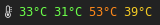
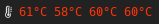
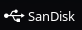
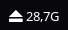
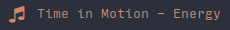

# polybar-scripts

This is a community project. We write and collect scripts for Polybar!

To find out how to write and use your own scripts, read [Polybars wiki](https://github.com/jaagr/polybar/wiki).

This repository is not an exact blueprint. I guess every script has to be customized to make your Polybar unique. We cannot guarantee that all scripts will work because many scripts are written for very specific purposes. But we're trying.

Your script isn't here yet? You have ideas to extend the scripts or descriptions? Send us your pull request or join us on freenode's `#polybar`.

## all colors are beautiful

## See also these other user repositories:

* [vyachkonovalov/polybar-gmail](https://github.com/vyachkonovalov/polybar-gmail): A Polybar module to show unread messages from Gmail
* [0nse/now_playing](https://github.com/0nse/now_playing): Output the currently scrobbling song
* [dakuten/taskwarrior-polybar](https://github.com/dakuten/taskwarrior-polybar): merely just a script showing the most urgent task and allowing it to be marked done
* [quelotic/polybarModules](https://github.com/quelotic/polybarModules): scripts for mail and caffeine
* [vyp/scripts](https://github.com/vyp/scripts): A script to show focused, occupied, free and urgent herbstluftwm tags in polybar
* [willHol/polybar-crypto](https://github.com/willHol/polybar-crypto): A polybar script that displays the price of crypto-currencies

## Development

It's a good idea to look at the [skeleton](skeleton/).

Most scripts are shell scripts. Use ShellCheck to check the code for possible errors. A good start to try [ShellCheck](https://www.shellcheck.net/) is their website.

Use `#` or `#1`, `#2` .. as icon replacement in your scripts. Everyone use anoter icon font. So let the user decide which icon he wants to use.

Remove your colors unless they have a special function. This way scripts remain customizable.
