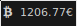

# polybar-scripts

This is a community project. We write and collect scripts for Polybar!

To find out how to write and use your own scripts, read [Polybars wiki](https://github.com/jaagr/polybar/wiki).

This repository is not an exact blueprint. I guess every script has to be customized to make your Polybar unique. We cannot guarantee that all scripts will work because many scripts are written for very specific purposes. But we're trying.

Your script isn't here yet? You have ideas to extend the scripts or descriptions? Send us your pull request or join us on freenode's `#polybar`.

## Hall of Fame

Is this your first time here? You should definitely take a look at these scripts:

* [openweathermap-fullfeatured](polybar-scripts/openweathermap-fullfeatured)
* [player-mpris-tail](polybar-scripts/player-mpris-tail)
* [battery-combined-udev](polybar-scripts/battery-combined-udev)
* [system-bluetooth-bluetoothctl](polybar-scripts/system-bluetooth-bluetoothctl)
* [notification-reddit](polybar-scripts/notification-reddit)
* [inbox-imap-shellnetrc](polybar-scripts/inbox-imap-shellnetrc)
* [isrunning-service](polybar-scripts/isrunning-service)
* [system-usb-udev](polybar-scripts/system-usb-udev)
* [updates-pacman-aurhelper](polybar-scripts/updates-pacman-aurhelper)
* [info-hackspeed](polybar-scripts/info-hackspeed)

##  Setup

* Save the script of your choice somewhere at `~/.config/polybar/`.
* Don't forget to make the script executable: `chmod +x ~/.config/polybar/script.sh`.
* Copy the module settings into your configuration file.
* Replace the appropriate icon strings in the script (e.g. replace `#1` with `🎉`).

## all colors are beautiful

## See also these other user repositories:

* [vyachkonovalov/polybar-gmail](https://github.com/vyachkonovalov/polybar-gmail): A Polybar module to show unread messages from Gmail
* [vyachkonovalov/bar-protonmail](https://github.com/vyachkonovalov/bar-protonmail): A Waybar/Polybar module for ProtonMail
* [0nse/now_playing](https://github.com/0nse/now_playing): Output the currently scrobbling song
* [DRKblade/polybar-warrior](https://github.com/DRKblade/polybar-warrior): A script to browse through your tasks and mark them as done.
* [dakuten/taskwarrior-polybar](https://github.com/dakuten/taskwarrior-polybar): Merely just a script showing the most urgent task and allowing it to be marked done
* [quelotic/polybarModules](https://github.com/quelotic/polybarModules): Scripts for mail and caffeine
* [vyp/scripts](https://github.com/vyp/scripts): A script to show focused, occupied, free and urgent herbstluftwm tags in polybar
* [willHol/polybar-crypto](https://github.com/willHol/polybar-crypto): A polybar script that displays the price of crypto-currencies
* [DanaruDev/UnseenMail](https://framagit.org/DanaruDev/UnseenMail): Polybar Python script for viewing unread email from multi accounts
* [drdeimos/polybar_another_battery](https://github.com/drdeimos/polybar_another_battery): Simple battery charge level watcher with notifications (libnotify)
* [zemmsoares/polynews](https://github.com/zemmsoares/polynews): Read news on your polybar
* [nivit/polybar-module-earthquake](https://github.com/nivit/polybar-module-earthquake): Polybar module for showing the latest seismic event on Earth
* [nivit/polybar-module-news](https://github.com/nivit/polybar-module-news): This polybar module displays RSS/Atom feeds
* [HackeSta/polybar-kdeconnect](https://github.com/HackeSta/polybar-kdeconnect): KDEConnect module for Polybar
* [zemmsoares/polybar-node-version](https://github.com/zemmsoares/polybar-node-version): Script to check Node.js version
* [Jvanrhijn/polybar-spotify](https://github.com/Jvanrhijn/polybar-spotify): Shows the current song playing on Spotify
* [HackeSta/polybar-browsermediacontrol](https://github.com/HackeSta/polybar-browsermediacontrol): Browser Media Control module for Polybar
* [dietervanhoof/polybar-spotify-controls](https://github.com/dietervanhoof/polybar-spotify-controls): Set of modules provides controls for spotify
* [mihirlad55/polybar-spotify-module](https://github.com/mihirlad55/polybar-spotify-module): Lightweight programs to integrate spotify into polybar
* [unode/polypomo](https://github.com/unode/polypomo): Minimalist pomodoro style timer
* [marioortizmanero/polybar-pulseaudio-control](https://github.com/marioortizmanero/polybar-pulseaudio-control): A feature-full polybar module to control pulseaudio
* [budlabs/polify](https://github.com/budlabs/polify): A utility that makes it easier to manage and work with polybars IPC-modules
* [VineshReddy/polybar-redshift](https://github.com/VineshReddy/polybar-redshift): Change, display temperature and open/close Redshift
* [gitlab.com/indeedwatson/polybar_twitch](https://gitlab.com/indeedwatson/polybar_twitch): Display live Twitch channels
* [jbirnick/polybar-timer](https://github.com/jbirnick/polybar-timer): Simple & customizable timer (can be used for pomodoro tracking).
* [zack-ashen/polystock](https://github.com/zack-ashen/polystock): Simple stock ticker displayer for displaying stock prices.
* [Hackesta/polybar-qbittorrent](https://github.com/HackeSta/polybar-qbittorrent): qBittorrent Module for Polybar
* [jbirnick/polybar-todoist](https://github.com/jbirnick/polybar-todoist): Displays amount of Todoist tasks of each priority.
* [PrayagS/polybar-spotify](https://github.com/PrayagS/polybar-spotify): Spotify status and controls module for Polybar with text scrolling
* [Hackesta/polybar-speedtest](https://github.com/HackeSta/polybar-speedtest): speedtest.net Module for Polybar
* [MaxdSre/mpris-player-control](https://github.com/MaxdSre/mpris-player-control): Control player via MPRIS D-Bus interface
* [maksmeshkov/toggl_polybar](https://github.com/maksmeshkov/toggl_polybar): Information about current running task for toggl.com time tracker users
* [shervinsahba/polybar-vpn-controller](https://github.com/shervinsahba/polybar-vpn-controller): VPN controller (toggle VPN, display location or IP, choose location via rofi menu, copy IP to clipboard)
