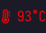
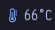
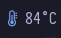
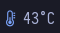

# Script: cpu temperature
small script to get cpu temperature

# Dependencies

- `sensors`
- `xsensors`

# screenshot

   

# Module
```
;; _-_-_-_-_-_-_-_-_-_-_-_-_-_-_-_-_-_-_-_-_-_

[module/cpuTemp]
type = custom/script
exec = ~/.config/bspwm/polybar/scripts/heatSensors
interval = 0.5
click-left = xsensors
format-foreground = ${color.BLUE}

;; _-_-_-_-_-_-_-_-_-_-_-_-_-_-_-_-_-_-_-_-_-_

```
