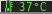
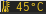
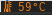
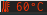

# Script: Monitoring-cpu-temperature

A script that displays the temperature follows the color change.







## Dependencies

* `sensors`


## Module

```ini
[module/temperature]
type = custom/script
exec = ~/.config/polybar/scripts/tempcores.sh
interval = 2
format-padding = 0
format-foreground = ${colors.foreground}
format-background = ${colors.background}
format-underline = #C1B93E
format-prefix-foreground = #C1B93E
label =%output:0:150:%
```
> tips:  
Modify the polybar script execution location `exec=xxx.sh` to your own actual script location.
