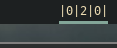

# Polybar - Docker Container
Show the number of containers of a certain status

**Requires docker without `sudo` see: https://askubuntu.com/questions/477551/how-can-i-use-docker-without-sudo**

## Status configuration
You can decide which container of which status you want to be shown.
Available status are:
* created
* restarting
* running
* removing
* paused
* exited
* dead

Just add the wanted status in the `status`-List in `docker-container.sh`.

As default, you will see `running`, `exited` and `dead`.

## Screenshot


## Config
In your `~/.config/polybar/config` add

```sh
[module/docker-container]
type = custom/Script
exec = ~/polybar-scripts/docker-container.sh
interval = 10
```
