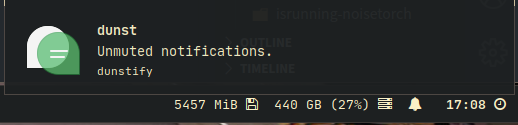

# dunstctl, a dunst controller script & module

This script is written in [`fish`](https://fishshell.com/), and displays a bell
icon that can be used to interact with [`dunst`](https://github.com/dunst-project/dunst)
via `dunstctl`, and utilises `dunstify` to send notifications.

Click to show historic notifications, middle-click to mute/unmute notifications,
and right-click to dismiss all.

`chmod +x $HOME/.config/polybar/scripts/dunstctl` (or the path of your choice.)

## Preview




## Example module

```ini
[module/dunstctl]
click-left = dunstctl history-pop
click-middle = $HOME/.config/polybar/scripts/dunstctl.sh toggle
click-right = dunstctl close-all
double-click-left = $HOME/.config/polybar/scripts/dunstctl.sh show-all
exec = $HOME/.config/polybar/scripts/dunstctl.sh
interval = 1.6
type = custom/script
```
