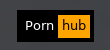

# Script: easteregg-pornhub

A script that shows a button and opens a random video at a large porn website.




## Configuration

Set your browser at the `click-left` option in your module.

You should also enable the overline and underline option in your polybar.

```ini
[bar/barname]

overline-size = 5
underline-size = 4
```


## Module

```ini
[module/easteregg-pornhub]
type = custom/script
exec = echo " hub "
interval = 3600
click-left = "firefox --private-window https://pornhub.com/random" &

format = <label>
format-prefix = "  Porn "
format-prefix-foreground = #ffffff
format-prefix-background = #000000

format-overline = #000000
format-underline = #000000
format-foreground = #000000
format-background = #ffa500

format-suffix = " "
format-suffix-background = #000000
format-suffix-foreground = #000000
```
