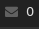

# Script: inbox-imap-pythongpg

A script that shows if there are unread mails in your IMAPs inbox. Passwords are encrypted with gpg.




## Configuration

You must have a gpg key to secure your password in configuration files. Encrypt your password using your gpg key like this.

```ini
echo 'your password' > /tmp/imappass
gpg -er 'your gpg keyid' /tmp/imappass
mv /tmp/imappass.gpg ~/.imappass.gpg
shred /tmp/imappass && rm /tmp/imappass
```

For Gmail, you must allow [less secure apps](https://myaccount.google.com/security#connectedapps).


## Module

```ini
[module/inbox-imap-pythongpg]
type = custom/script
exec = ~/polybar-scripts/inbox-imap-pythongpg.py
interval = 60
```
