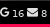

# UnseenMail
Polybar Python script for viewing unread email from multi accounts

Only works with IMAP Protocol and Gmail APIs

 

# Dependencies
- Polybar
- Python 3
- FontAwesome V4 (see your Distribution font configuration)
- python Gmail APIs library (if you want to use Gmail APIs instead of IMAP for your Google accounts):
    	
    	
        pip install --upgrade google-api-python-client

# Install

1 - Clone this repo

2 - install all dependencies 

3 - Add following to your polybar configuration file

	  [module/unread_mail]
	  type = custom/script
	  
	  label-font = 2
	  format-underline = #f50a4d
	  click-left=  thunderbird & ; you can set your own client
	  format = <label>
	  exec = python path/to/python/script/UnseenMail.py
	  interval = 100

4 - Add accounts to accounts.ini (in script folder)

	#Configuration example for email accounts
	[Example IMAP]
	protocol=IMAP
	host=imap.gmail.com
	port=993
	useSSL = true
	login = email
	password = password
	icon=
	
	[Example GMAILAPI]
    protocol = GmailAPI
    icon=

For GmailAPI you can declare many accounts defining custom category names. For example, if you have 2 accounts, you can do this:
    
    [FirstGmail]
    protocol = GmailAPI
    icon=

    [FirstGmail]
    protocol = GmailAPI
    icon=
    
5 - Run it !