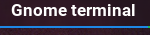

# Script: Display current window / application

A shell script that shows your focused window/application




## Dependencies
- xdotool
- WM needs to use the "WM_CLASS" property

## Module

```ini
[module/awindow]
 type = custom/script
 exec = ~/.config/polybar/scripts/window.sh
 tail = true
```
