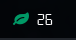

# Script: info-airqualityindex

A script that shows the local World Air Quality Index. It's an indicator for the air pollution.




## Dependencies

* `curl`
* `jq`


## Configuration

You need an API token. [Request one](https://aqicn.org/data-platform/token/).

Choose a city and make sure that the result is what you expect. `berlin` is a valid `CITY` here: http://aqicn.org/city/berlin/. Or use the [map](https://aqicn.org/map/) to find a monitoring station near you. `germany/berlin/friedrichshain-frankfurter-allee` works also as `CITY`.

If `CITY` is left empty, the location is retrieved via the Mozilla Location API.


## Module

```ini
[module/info-airqualityindex]
type = custom/script
exec = ~/polybar-scripts/info-airqualityindex.sh
interval = 600
```
