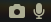

# Script: info-camera-mic

A shell script for displaying an indicator of camera and microphone usage.




## Module (pulseaudio)

```ini
[module/info-camera-mic]
type = custom/script
exec = ~/polybar-scripts/info-camera-mic.sh
interval = 5
```

## Module (pipewire + pipewire-pulse)

```ini
[module/info-camera-mic]
type = custom/script
exec = ~/polybar-scripts/info-camera-mic-pipewire.sh
interval = 5
```
