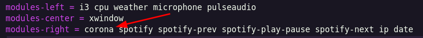
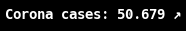

# Corona Widget for Polybar

This widget allows you to show the current Coronavirus cases in your area.

## Example Screenshot


## Dependencies

```
python3
```

# Setup

1. Install `python3` if you don't have it installed yet.
2. Move `coronaWidgets.py` to your polybar-scripts path.
3. Add script to polybar-config (`~/.config/polybar/config`)

-   Add to modules-list:
    
-   Add module:

```ini
[module/corona]
type = custom/script
interval = 3600
format = <label>
exec = python ~/.config/polybar/scripts/coronaWidget.py united-states
```

4. Customize arguments.

## List of arguments:

```
usage: coronaWidget.py [-h] [-p PROVINCE] [-pre PREFIX] [-suf SUFFIX] [-ar] [-up UPARROW] [-dw DOWNARROW] [-lo] country

positional arguments:
  country               Specify the country you want to display.

optional arguments:
  -h, --help            show this help message and exit
  -p PROVINCE, --province PROVINCE
                        Specify the province of the coutry you want to display.
  -pre PREFIX, --prefix PREFIX
                        Specify a prefix for the printed string.
  -suf SUFFIX, --suffix SUFFIX
                        Specify a suffix for the printed string.
  -ar, --enable-arrow   Enable the arrow icon.
  -up UPARROW, --up-arrow UPARROW
                        Change the 'up'-arrow character.
  -dw DOWNARROW, --down-arrow DOWNARROW
                        Change the 'down'-arrow character.
  -lo, --enable-locale  Enable decimal points.
```

### Example:

```
python ~/.config/polybar/scripts/coronaWidget.py germany -p "Bayern" -ar -lo -pre "Corona cases: "
```

### Result:



## Finding Country-names / Province names

### Finding country name:

1. Open [this](https://api.covid19api.com/countries) link in your browser and look for your country.
2. Copy the `slug`-value of your country.

### Finding province name:

1. Open `https://api.covid19api.com/live/country/`COUNTRY-NAME`/status/confirmed` in your browser and look for your province.
2. Copy the `Province`-value of your province.

# Uninstallation

-   Remove cache-directory:

```bash
rm -r ~/.cache/coronaWidgetPolybar/
```

-   Delete `coronaWidget.py`

# Contributing

If you want to add a new feature, just submit a pull request :)
