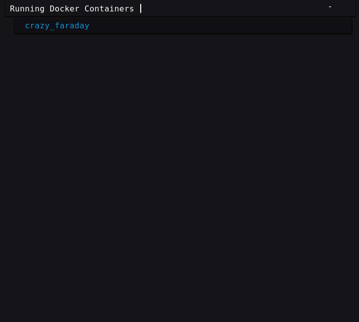
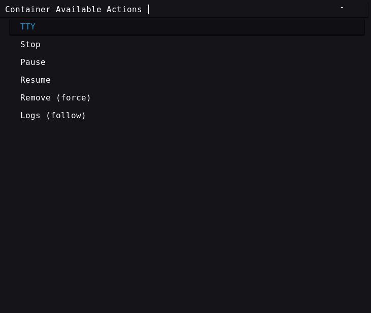

# Script: info-docker-advance

Shows if the docker service is running or not.<br>
Counts number of existin mages vs runing containers.<br>
Incoporates Rofi Menu to perform actions on hte runing containers


<br>




## Dependencies
* Systemd
* Docker ( on systemd )
* rofi
* Font Awesome 5 Free ( or any other unicode font contains the charachter `UTF-8: 0xEF 0x8E 0x95` `UTF-16: 0xF395` ( docker icon ) )

## Configuration

You have to add the `docker` command to the `/etc/sudoers` NOPASSWD of your user:

```ini
user ALL=(ALL) NOPASSWD: /usr/bin/docker ps -qf status=running
user ALL=(ALL) NOPASSWD: /usr/bin/docker ps -qf status=exited
user ALL=(ALL) NOPASSWD: /usr/bin/docker ps -qf status=dead
```


## Module


```ini
[module/info-docker]
type = custom/script
exec = ~/.config/polybar/scripts/docker.sh
interval = 10
click-left = ~/.config/polybar/scripts/docker.sh rofi-left &
click-right = ~/.config/polybar/scripts/docker.sh rofi-right &
```
