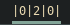

# Script: info-docker

Show the number of docker containers in a certain state.




## Configuration

You have to add the `docker` command to the `/etc/sudoers` NOPASSWD of your user:

```ini
user ALL=(ALL) NOPASSWD: /usr/bin/docker
```


## Module

```ini
[module/info-docker]
type = custom/script
exec = ~/polybar-scripts/info-docker.sh
interval = 60
```
