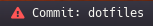

# Script: Info git

A shell script that shows information about git repositories.




## Dependencies

- git
- grep


## Configuration

- edit the `DIRS` and `NAMES` variables in the script with the repositories that
you want to monitor
- edit the `diff_message` variable if you want a custom alert message


## Module

```ini
[module/info-git]
type = custom/script

exec = ~/.config/polybar/scripts/info-git.sh
interval = 60

label=%output%
label-foreground =

format-prefix = "# "
format-prefix-foreground =
```
