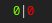

# Script: info-healthchecks.io

Shows the health of your services registered with [healthchecks.io](https://healthchecks.io).




## Dependencies

* `jq`
* `curl`


## Configuration

Modify any of the all-caps variables to configure the script:
* `API_KEY`: Your [healthchecks.io](https://healthchecks.io) API key. These are project specific and can be generated on the project settings page.
* `CHECK_ENDPOINT`: URL of the checks API endpoint. Change if self-hosting.
* `STATES`: Array of states to monitor. Available options: `"up" "down" "new" "pending" "grace" "started" "paused"`
* `COLORS`: Associative array that maps a color to each configured state. Defaults to white (#ffffff).
* `SHOWN_TAGS`: Array of tags to show. Leave empty to disable filtering based on tags.


## Module

```ini
[module/info-healthchecks.io]
type = custom/script
exec = ~/polybar-scripts/info-healthchecks.io.sh
interval = 60
```
