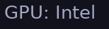

# polybar-optimus-manager

A script that shows the current GPU in use, given that the GPUs are managed by [optimus-manager](https://github.com/Askannz/optimus-manager). The script also allows for switching GPU in one click, just **please** be aware that this will log you out of your session without asking for confirmation. See below how this can be enabled.



## Configuration

1. Edit the script and change the "Configuration" part to your liking. This is not necessary if you don't use the "Hybrid" mode in optimus-manager and you're happy with the default outputs. 
2. (Optional, enables switching GPU when the module is left-clicked). Uncomment the line `;click-left = ~/polybar-scripts/info-optimus-manager.sh --switch` in the module.


## Module

```ini
[module/info-optimus-manager]
type = custom/script
exec = ~/polybar-scripts/info-optimus-manager.sh
interval = 1200 
;click-left = ~/polybar-scripts/info-optimus-manager.sh --switch

```

