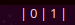

# Script: info-podman
Shows the number of Podman containers in one of the states: `created`, `exited`, `paused`, `running`, `unknown`  

  

## Configuration
Podman has to be configured for rootless use. See [Basic Setup and Use of Podman in a Rootless environment.](https://github.com/containers/podman/blob/master/docs/tutorials/rootless_tutorial.md)  

## Module
```ini
[module/info-podman]
type = custom/script
exec = ~/polybar-scripts/info-podman.sh
interval = 60
```
