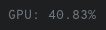

# Script: radeontop-status

A script to show AMD GPU usage using radeontop




## Dependencies

* radeontop
* python3


## Configuration

Inside radeontop.py, there are 2 variables named `radeontop_fields` and `format_string`. You can edit these two according to your needs.


## Module

```ini
[module/info-radeontop]
type = custom/script
exec = ~/polybar-scripts/radeontop.py
interval = 0.5
```

