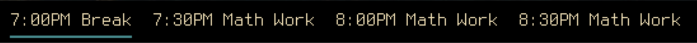

#Display Schedule On Bar

Requirments:
- Python 3
..* Pandas
..* Numpy

From a schedule file displays your current schedule task and next or previous tasks. A schedule file is a .csv file, blocked by time and day with description in each cell, like the example file included. The delimiter can be changed arbitrarily as long as it is changed correspondingly in the script.
The way it is set up is that in polybar, the module is defined as follows
```
[module/schedulep0]
type = custom/script
exec = ~/.scripts/sched.py 0
format-underline = ${colors.secondary}
tail = true
```
` modules-center = schedulep0 schedulep1 schedulep2 `
where exec points to the path to the sched.py script and the argument if what time offset to use for display. 0 means to display the task for the current time, 1 means for the task in the timeblock after the current one, 2 is 2 time blocks after etc. It also works in reverse, so -1 show the time and task of the previous time block. I personally have set it up to have 3 modules,  with arguments 0,1,2 respectively and with the 0 block underlined.



