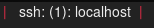

# Script: info-ssh-sessions

A script that displays the count of current ssh sessions as well as the public IP address of the fist session.




## Dependencies

* `lsof`


## Module

```ini
[module/info-ssh-sessions]
type = custom/script
exec = ~/polybar-scripts/info-ssh-sessions.sh
interval = 5
```
