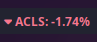

# Script: info-stocks

Script that allows you to display the change of a stock on Polybar in the same
day. Uses python3 and **yfinance**.



## Dependencies

* **python3**
* **yfinance**

## Configuration

* The script needs to be configured with the text to show of each ticker. 4
  emojis are suggested
* The module needs to specify a list of tickers to track. Multiple tickers are
  supported.
* The module needs to specify a python3 executable path with yfinance, of
  course.

## Module

```ini
[module/stock_tracker]
type = custom/script
exec = path/to/venv/bin/python ~/.config/polybar/src/stock_tracker.py --tickers AAPL MSFT
interval = 60
format = <label>
label = %output%

``` 
