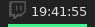
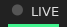

# Script: info-stream-countdown

This script pulls the time a live streamer is streaming from their Streamlabs countdown on their twitch page. Please note that because Streamlabs does not have a public API, a Chromium process is launched to gather the information. This will use about 250 MiB of memory for a few seconds every hour. You can also include multiple instances of this on your bar to view the stream times of multiple twitch streamers.

##### Note:
If you want to be show the seconds on the counter, you may uncomment the "showSeconds" line in the script. Please note that you may experience 10-20 seconds pauses every hour when the countdown updates.






## Dependencies

* Chromium: Required to gather data from Twitch page.
* [chrome-har-capturer](https://github.com/cyrus-and/chrome-har-capturer)
* `jq`
* Username of Twitch Streamer
* Twitch Client ID
    * Click [here](https://glass.twitch.tv/console/apps/create) and sign in.
    * Login, then go to Apps > Register
    * Use any name and category, and set OAuth Redirect URL to `http://localhost`
    * Click Manage on the application, and copy the Client ID from the end of the URL or from the box 
## Module

```ini
[module/info-stream-countdown]
type = custom/script
exec = ~/polybar-scripts/info-stream-countdown.sh <streamer username>
tail = true
```
