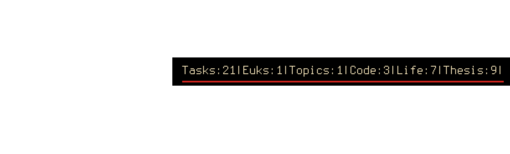

#Summize Task List by Category

Requirments:
- [t task manager](http://stevelosh.com/projects/t/)

Tasks with t shoud be added as such `~/src/t.py Topic: description of topic`. This way topics can be delimited from tasks. The module displays the number of tasks for each topic and the total number of tasks. Note: you may need to change the path to the task file if yours is not `$HOME/tasks/tasks`.

