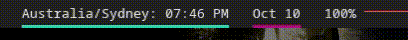

# Script: info-timezone

A custom polybar script to  switch the timezone of the date displayed.




## Module

```ini
[module/info-timezone]
type = custom/script
exec = ~/polybar-scripts/info-timezone.sh
tail = true
click-left = kill -USR1 %pid%
```
