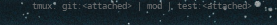
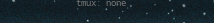

# Script: info-tmux-sessions

A simple script to show tmux sessions.





## Module

```ini
[module/info-tmux-sessions]
type = custom/script
exec = ~/polybar-scripts/info-tmux-sessions.sh
interval = 5
```
