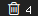

# Script: info-trash

This script count the files in you trash directory.




## Module

```ini
[module/info-trash]
type = custom/script
exec = ~/polybar-scripts/info-trash.sh
interval = 60
click-left = ~/polybar-scripts/info-trash.sh --clean
```
