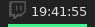
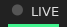

# Script: info-twitch-countdown

This script pulls the time a live streamer is streaming from their Streamlabs countdown on their twitch page.

Please note that because Streamlabs does not have a public API, a Chromium process is launched to gather the information. This will use about 250 MiB of memory for a few seconds every hour. You can also include multiple instances of this on your bar to view the stream times of multiple twitch streamers.





## Dependencies

* `chromium`
* `jq`
* [cyrus-and/chrome-har-capturer](https://github.com/cyrus-and/chrome-har-capturer)


## Configuration

Get a Twitch Client ID:

* Go to [twitch.tv/console/apps/create](https://glass.twitch.tv/console/apps/create) and sign in
* Login, then go to `Apps` > `Register`
* Use any name and category, and set OAuth Redirect URL to `http://localhost`
* Click Manage on the application, and copy the Client ID from the end of the URL or from the box

If you want to be hide the seconds on the counter, you may comment the "showSeconds" line in the script. Please note that you may experience 10-20 seconds pauses every hour when the countdown updates.


## Module

```ini
[module/info-twitch-countdown]
type = custom/script
exec = ~/polybar-scripts/info-twitch-countdown.sh <streamer username>
tail = true
```
