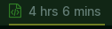

# info-wakatime



Display your daily coding time in [Polybar](https://github.com/polybar/polybar).
## Prerequisites
- [WakaTime](wakatime.com) account and API token 
- Polybar 

## Dependencies

- [jq](https://stedolan.github.io/jq/) for JSON parsing in bash
- curl 

## Security 

In the script file there is a `MYTOKEN` placeholder for you to replace with your WakaTime API key. It is not recommended that you store your key as plaintext in the script file but it is left up to the user to implement appropriate safeguards. 

## Installation
Follow standard procedure:
* Save the [polybar_wakatime.sh](./polybar_wakatime.sh) script wherever you keep your scripts in `.config/polybar/`
* Make it executable
* Add the module definition to `polybar/config.ini`:

```ini
[module/wakatime]
type = custom/script
exec = ~/dotfiles/polybar/polybar_scripts/wakatime_status/polybar_wakatime.sh
interval = 10
; add yer own icon and preferred styling etc 
format-prefix = " "
format-underline = #707f23
format-prefix-foreground = #2f7e25 
label-padding = 1
```
