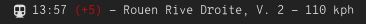

# Script: info-nomadkronoplus

When connected to the in-train Wi-Fi network of [Nomad Krono+ trains in the French Normandie](https://www.ter.sncf.com/normandie/services-contacts/services/krono-plus), this script shows the next stop, arrival time, and other information. The data is sourced from the local train information portal.
Obviously, this script was hacked over the course of several train journeys. 🚄



## Dependencies

* `bc` (the [GNU basic calculator](https://www.gnu.org/software/bc/)), `jq`, and `curl` need to be in `$PATH`
* You have to be logged in to the local SSID `NormandieTrainConnecte`.

## Module

```ini
[module/info-nomadkronoplus]
type = custom/script
exec = ~/polybar-scripts/info-nomadkronoplus.sh
interval = 10
```
