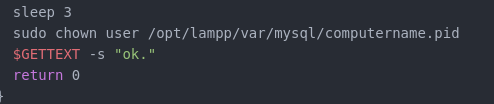

# Script: XAMPP status 

The Script prints the status of XAMPP services (Apache, MySQL, ProFTPD) if they are running. Otherwise, the script prints nothing.


## Dependencies
[XAMPP](https://www.apachefriends.org/de/index.html)

## Module

```
[module/xampp]
type = custom/script
interval = 10
label = %output%
exec = ~/./.skript/xampp-status.sh
```

## Troubleshooting
To show the MySQL Server status, the script must own a file in /opt/lampp/var/MySQL. <br>
To solve this I edited the xampp script in /opt/lampp/ in the startMySQL() function,  <br>
The sleep is imported because the file need some time to create.
The file is owned by the mysql user. May you can fix that problem on Otherwise. This is only one solution.
