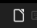

# Script: libreoffice-on-your-polybar

Open LibreOffice quickly from your polybar.



## Dependencies

- `libreoffice`

## Module

```ini
[module/libreoffice-on-your-polybar]
type = custom/text
click-left = libreoffice
label = " "
```
