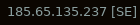

# Script: Ipfinder

Shows your public IP address (and country of origin) retrieved from `ipinfo.io`.



## Dependencies

```bash
sudo apt install -y curl jq
```

## Module

```ini
[module/network]
type = custom/script
exec = ~/.config/polybar/ipfinder.sh
interval = 60
```

The interval (60 seconds) is important since free usage is limited to 50,000 API requests per month. 

