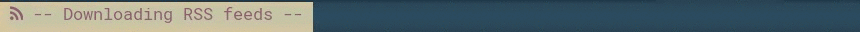

# Script: news

This script displays [RSS](https://en.wikipedia.org/wiki/RSS) feeds. Then you can read news in your browser by a simple click on the bar.




## Installation
Clone or download this repository, then run the following commands:
```
$ cd polybar-scripts/polybar-scripts/news
$ sh install.sh
```

Add your favorite RSS feeds to `~/.config/.polybar/scripts/news/rss.feeds`

Enable this module in your bar, e.g:

```
[bar/mybar]
...
modules-left = news ...
...
```

Configure the module (see below) and then restart polybar.

## Dependencies
This script requires [bash](https://www.gnu.org/software/bash/), Python 3 and the feedparser module (install it with `pip3 install --user feedparser` or with your packages manager). Alternately you can use [rsstool](https://sourceforge.net/projects/rsstool/files/rsstool-1.0.0-linux.tar.gz/download) and [wget](https://www.gnu.org/s/wget/).

## Configuration
Edit the file `~/config/polybar/scripts/news/news.conf` and set up the right Python 3 interpreter if you do not use rsstool.

You can change the interval between two headlines by editing the following file:

```
~/config/polybar/scripts/news/module.conf
```

## Running
Click on the news headline on the bar to open the relative web page in your browser.


## Module
The provided `install.sh` script configures polybar automatically with the following code:

```
[module/news]
type = custom/script
interval = 10 ; seconds
exec = ~/.config/polybar/scripts/news/news.sh
click-left = ~/.config/polybar/scripts/news/news.sh url
; Unicode Character U+F09E (use Font Awesome)
;format-prefix = " "
```
