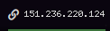

# Script: nordvpnstatus

A small script to show the NordVpn status.

If NordVpn is connected the IP address will be displayed. Otherwise it displays `VPN DISCONNECTED`.




## Dependencies

* `nordvpn`

## Module

```ini
[module/vpn-anyconnect-status]
type = custom/script
exec = ~/bin/nordvpnstatus.sh
interval = 5
```
