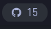
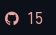

# Script: notification-github

A small script that shows your GitHub notifications.


## Dependencies

* `curl`
* `jq`

## screenshot
   

## Configuration

Generate a token at `GitHub Settings` > `Developer settings` > `Personal access tokens`.


## Module

```ini
[module/notification-github]
type = custom/script
exec = ~/polybar-scripts/notification-github.sh
interval = 60
```
