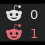

# Script: notification-reddit

A script that shows if there are unread mails in your reddit inbox.




## Dependencies

* `curl`
* `jq`


## Configuration

Open [reddit.com/prefs/feeds/](https://www.reddit.com/prefs/feeds/). Copy the `JSON` link from `your inbox` > `unread messages`.

Add your username at the end of `USERAGENT` to create a unique string.


## Module

```ini
[module/notification-reddit]
type = custom/script
exec = ~/polybar-scripts/notification-reddit.sh
interval = 60
```
