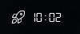

# Script: notification-spacex

A script that shows when the next launch is planned.




## Dependencies

* `curl`
* `jq`


## Module

```ini
[module/notification-spacex]
type = custom/script
exec = ~/polybar-scripts/notification-spacex.sh
interval = 600
```
