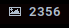

# Script: notification-xkcd

Displays the current xkcd comic and whether there are any new ones in polybar, written in python.

 



## Dependencies

* [`Python: requests`](https://pypi.org/project/requests/)


## Configuration

To set the icon or the location of the save file, edit `icon` or `latest_file` in `notification-xkcd.py`. Note that you cannot use `~` to indicate your home directory, as python needs a full path by default.

## Module

```ini
[module/notification-xkcd]
type = custom/script
exec = ~/polybar-scripts/notification-xkcd.py
click-left = xdg-open https://xkcd.com/ && ~/polybar-scripts/notification-xkcd.py read
interval = 60
```
