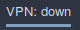
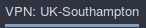

# Script: openvpn-status

Show the running openvpn config file





## Configuration

* Config files must have an extension, e.g. `.ovpn`.
* Config files must in a folder, e.g. `/etc/openvpn/conf.d`.

Launch your vpn using the following command:

```
openvpn --daemon --auth-nocache --cd "/etc/openvpn/conf.d" --config "UK-Southampton.ovpn"
```

## Module

```ini
[module/openvpn]
type = custom/script
exec = ~/polybar-scripts/openvpn-status.sh
interval = 5
```
