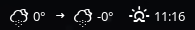

# Script: openweathermap-fullfeatured

A weather script that shows a lot of information.

It shows icons and temperatures for the current weather and the 3 hour forecast. It displays information about the next sunrise or sunset.

If `CITY` is left empty, the location is retrieved via the Mozilla Location API.  

Change these values:

```sh
KEY=""
CITY=""
UNITS="metric"
SYMBOL="°"
```




## Dependencies

* [OpenWeatherMap-Key](https://openweathermap.org/appid)
* [weather-icons](https://github.com/erikflowers/weather-icons)
* `jq`


## Module

```ini
[bar/polybar]
...
font-2 = Weather Icons:size=12;1
...
```

```ini
[module/openweathermap-fullfeatured]
type = custom/script
exec = ~/polybar-scripts/openweathermap-fullfeatured.sh
interval = 600
label-font = 3
```
