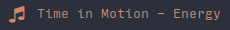

# Script: player-mpris-nopoll




This script displays the current track and the play-pause status without polling.
Information is obtained by listening to MPRIS events, so it is updated instantaneously on change.


## Dependencies

* [playerctl](https://github.com/acrisci/playerctl)


## Module
```ini
[module/player-mpris-nopoll]
type = custom/script
exec = ~/polybar-scripts/player-mpris-nopoll.py
tail = true
click-left = playerctl previous
click-right = playerctl next
click-middle = playerctl play-pause
```
