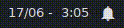

# Script : polybar-dunst-dnd

Polybar module to toggle do not disturb mode for dunst. 

## Demo



## Dependencies

* **Dunst** - For obvious reasons
* **Nerd Fonts** - To display icons 

## Configuration

1. Make the script executable

```ini
chmod +x dnd_status.sh
```
> This script will be responsible to display wether DND is on or off.

2. Change the script path in the module to your desired path


```ini
Eg :

exec = ~/path/to/script/dnd_status.sh

to 

exec = ~/.config/polybar/scripts/dnd_status.sh

```

3. To verify wether the script is running fine use the following command -

```ini
dunstctl is-paused
```
This will return either `false` meaning dnd is off or `true` meaning dnd is on.
## Module

```ini
[module/dnd]
type = custom/script
exec = ~/path/to/script/dnd_status.sh
interval = 1
click-left = dunstctl set-paused toggle

```

> This module will be used to toggle between DND `on` and  `off`.
