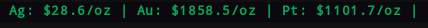

# polymetals
Custom polybar script that displays the price of silver, gold, and/or platinum.

## Python Modules Needed
* 'pandas'
* 'argparse'
* 'requests_html'
* 'yahoo_fin'

## Module Example
```ini
[module/polymetals]
type = custom/script
; -s or --silver to display Silver
; -g or --gold to display Gold
; -p or --platinum to display Platinum
exec = ~/.config/polybar/scripts/polymetals/polymetals.py -s -g -p
tail = true
label = %output%
```
## Example

