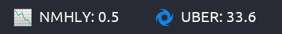

# PolyStock
Display stock prices on polybar...

## Example


In the example I have two seperate modules with `--biggestloser` on left and `--mostactive` on the right.
## Dependencies
* `python`

### Python Modules
* `yahoo_fin`
* `argparse`

## Module
```ini
[module/polystock]
type = custom/script
;Arguments for output:
;   --biggestloser: Prints the stock with the biggest drop in a given day.
;   --biggestgainer: Prints the stock with the biggest gain in a given day.
;   --mostactive: Prints the most active stock in a given day.
;   --topcrypto: Prints the top cryptocurrency by market cap in a given day.
;   --customticker: Takes a stock ticker (ex. AAPL, GOOGL, VZ) and outputs the live price of that stock.
exec = ~/polybar-scripts/polystock.py --biggestloser --biggestgainer --mostactive --topcrypto --customticker AAPL
;For continuous updates
tail = true
label = %output%
```

## Configuration

### polystock.py

```python
# How many decimal place to show in stock price.
roundNumber = 1
```


