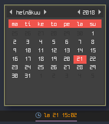

# Script: popup-calendar

A small script that displays the date and opens a small popup calendar with YAD when clicked.




## Dependencies

* [`yad`](https://sourceforge.net/projects/yad-dialog/)
* `xdotool`


## Configuration

Change these values if you want:

```sh
BAR_HEIGHT=22
BORDER_SIZE=1
YAD_WIDTH=222
YAD_HEIGHT=188
DATE="$(date +"%a %d %H:%M")"
```

If you use a tiling window manager you should enable floating for `yad-calendar`. This example is for `i3wm`:

```ini
for_window [class="Yad" title="yad-calendar"] floating enable
```


## Module

```ini
[module/popup-calendar]
type = custom/script
exec = ~/polybar-scripts/popup-calendar.sh
interval = 5
click-left = ~/polybar-scripts/popup-calendar.sh --popup &
```
