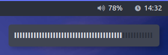

# Script: pulseaudio-notify

A script to control PulseAudio and show a volume notification.



The script uses polybar's tail function to display the adjustments in real time. Please note that there is already a polybar module [`pulseaudio`](https://github.com/jaagr/polybar/wiki/Module:-pulseaudio) for this task.

## Dependencies

* `pamixer`
* `dunst`
* `libcanberra` (If you want notification sounds)

## Configuration

### Increase/decrease volume increment
Change the `increment_amount` variable to change how much the volume changes by.

### Icons
Change the `icon_*` variables to your liking.

### Configure the volume notification
Change the variables `bar_color_filled`, `bar_color_not_filled`, `bar_glyph` to your liking. Change `bar_number_of_glyphs` so the width of the bar plays nicely with your `dunst` setup.

You might also want to use overrides within your `dunstrc` to change font family, size, spacing, timeout, history etc:

```ini
[volume]
  format = "<span font_family="unifont" font_size='small' letter_spacing='-492'>%b</span>"
  history_ignore = yes
  summary = "Volume notification"
  timeout = 2
```

### Sounds
If you have `libcanberra` installed, the script will play `audio-volume-change` from your sound theme when the volume changes. If you want to remove this functionality, remove the `play_sound` function from the `case` statement at the end of the script.

## Module

```ini
[module/pulseaudio-notify]
type = custom/script
exec = ~/polybar-scripts/pulseaudio-notify.sh
tail = true
click-left = ~/polybar-scripts/pulseaudio-notify.sh --mute &
scroll-up = ~/polybar-scripts/pulseaudio-notify.sh --up &
scroll-down = ~/polybar-scripts/pulseaudio-notify.sh --down &
```
