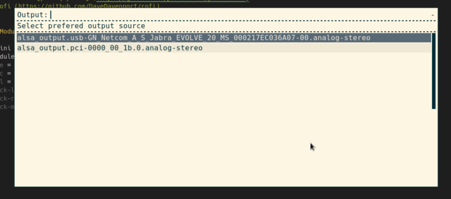

# Script: pulseaudio-rofi

This script displays the current volume for input/output.

Allows to adjust volume, mute. Uses rofi menu to change current output/input devices.





## Dependencies

* PulseAudio (pacmd, pactl)
* Rofi


## Module

```ini
[module/pulseaudio-rofi-output]
type = custom/script
exec = ~/.config/polybar/pulseaudio-rofi.sh --output_volume_listener
tail = true
click-right = ~/polybar-scripts/pulseaudio-rofi.sh --output
click-left = ~/polybar-scripts/pulseaudio-rofi.sh --mute
scroll-up =  ~/polybar-scripts/pulseaudio-rofi.sh --volume_up
scroll-down = ~/polybar-scripts/pulseaudio-rofi.sh --volume_down
```
```ini
[module/pulseaudio-rofi-input]
type = custom/script
exec = ~/.config/polybar/pulseaudio-rofi.sh --input_volume_listener
tail = true
click-right = ~/polybar-scripts/pulseaudio-rofi.sh --input
click-left = ~/polybar-scripts/pulseaudio-rofi.sh --mute_source
scroll-up =  ~/polybar-scripts/pulseaudio-rofi.sh --volume_source_up
scroll-down = ~/polybar-scripts/pulseaudio-rofi.sh --volume_source_down
```
