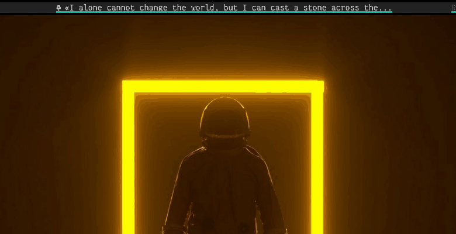

# Script: polybar-quotation

This polybar module reads file with famous quotations and shows them on bar. You can also truncate quotation.

  
- **Single Line Quote**

  
- **Multi Line Quote**

## Configuration

- Clone repository
  ```sh
  git clone https://github.com/pikulo-kama/polybar-quotation
  ```
- Move files to polybar scripts
  ```sh
  mv -r polybar-quotation/ ~/.config/polybar/scripts/
  ```
- Add this line to ```~/.config/i3/config``` file
  ```sh
  exec_always --no-startup-id $HOME/.config/polybar/scripts/polybar-quotation/quot.py --random 
  ```
- Open ```hooks.sh``` and change bar name to yours
  ```sh
  bar_name="Your bar name"
  ```
 - Install fonts from ```fonts``` directory (Optional)


## Module

  ```ini
  [module/quotation]
  type = custom/ipc
  hook-0 = ~/.config/polybar/scripts/polybar-quotation/quot.py --current-line
  hook-1 = ~/.config/polybar/scripts/polybar-quotation/quot.py --author

  initial = 1

  click-left = ~/.config/polybar/scripts/polybar-quotation/hooks.sh 1
  click-right = ~/.config/polybar/scripts/polybar-quotation/hooks.sh 2

  format-font = 3
  format-prefix = "Y  "
  format-underline = #15b39b
  ```
  Make sure you have ipc enabled in your bar, if not add this line to ```[bar/name]``` section
  ```ini 
  enable-ipc = true
  ```
  
  If you installed fonts then add this line to your ```[bar/name]``` section
  ```ini 
  font-2 = "Iconic Pictograms Bold:size=11;4"
  ```
  
  **NOTE:** if you want to change quote just restart your i3wm (```$mod+shift+r```)


